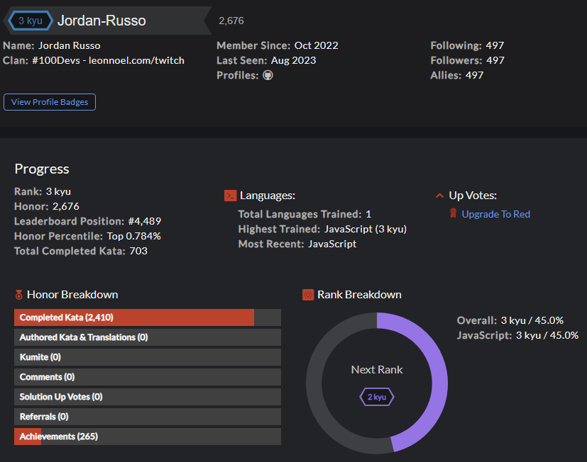

# Daily CodeWars <a target="_blank" href="https://www.codewars.com/users/Jordan-Russo">Challenges & Solutions</a>

A repository filled with Daily Coding Challenges (katas) to hone and refine critical thinking and problem-solving skills. 
Currently Ranked <strong>top 1%</strong> on the global leaderboard, Completed <strong>500+</strong> challenges and Push <strong>7+</strong> solutions every week.

## How It's Made:

**Featured Tech:** <picture></picture>

A unwavering commitment to improving myself daily through trial and challenge.

## Optimizations/Refactoring

My solutions often contain multiple version of solutions as I think through the trade-offs of different ways to solve the same problem.
Optimizations are made to establish a balance of readability and performance while minimizing costs. 

## Learned Lessons:

One of the biggest lessons I have learned through tackling an extensive range of questions is the importance of comprehending the question or prompt before attempting to solve it. 
One effective method for doing this is to analyze the examples and examine the description for any edge cases.

Once you have grasped the question, you may not have an optimal solution, but with good pseudo-code, you can begin the thought process and consider the time and space complexity involved in your solution. 
This may lead you to discover optimal solutions for problems that initially seemed unsolvable.

In my experience, I have completed pseudo-code for questions before, and started solving it, but then thought of a better way to solve the problem and revised my solution after completing the current one. 
By reflecting on your code and reviewing the work of others, you can gain valuable exposure to the syntax and most effective structuring patterns of a language.

